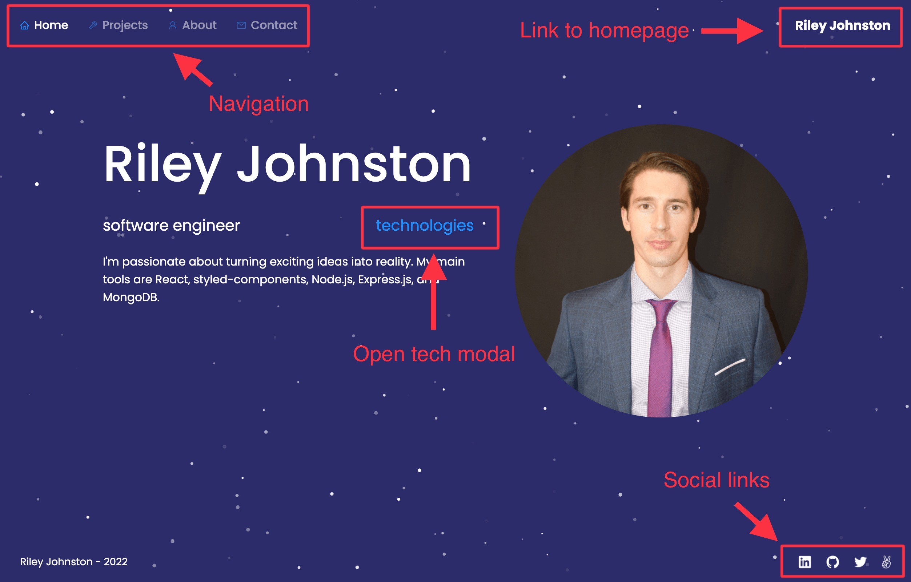
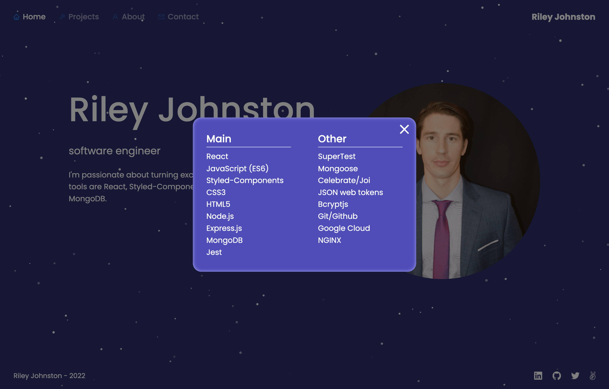
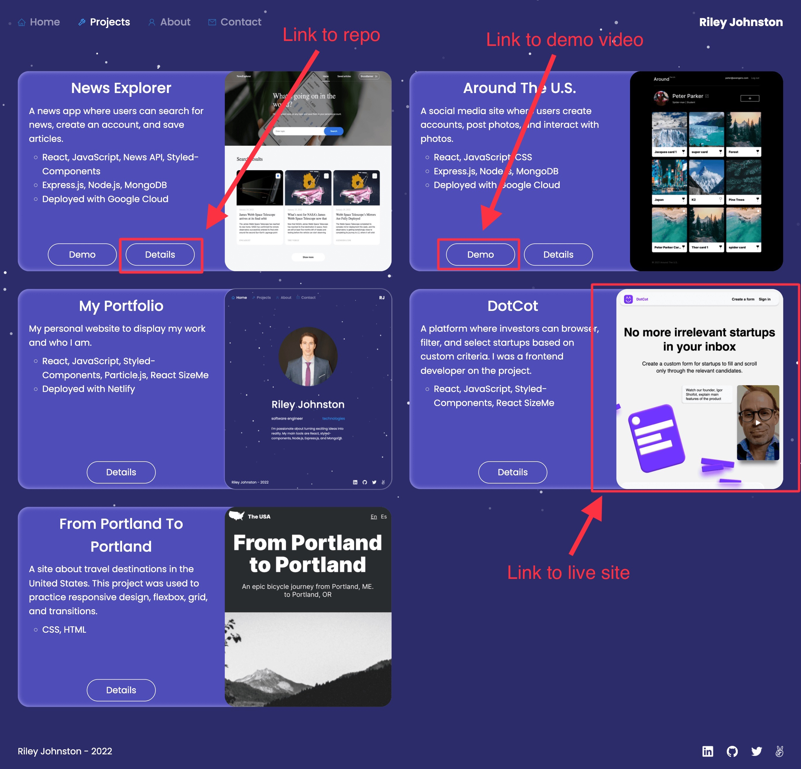
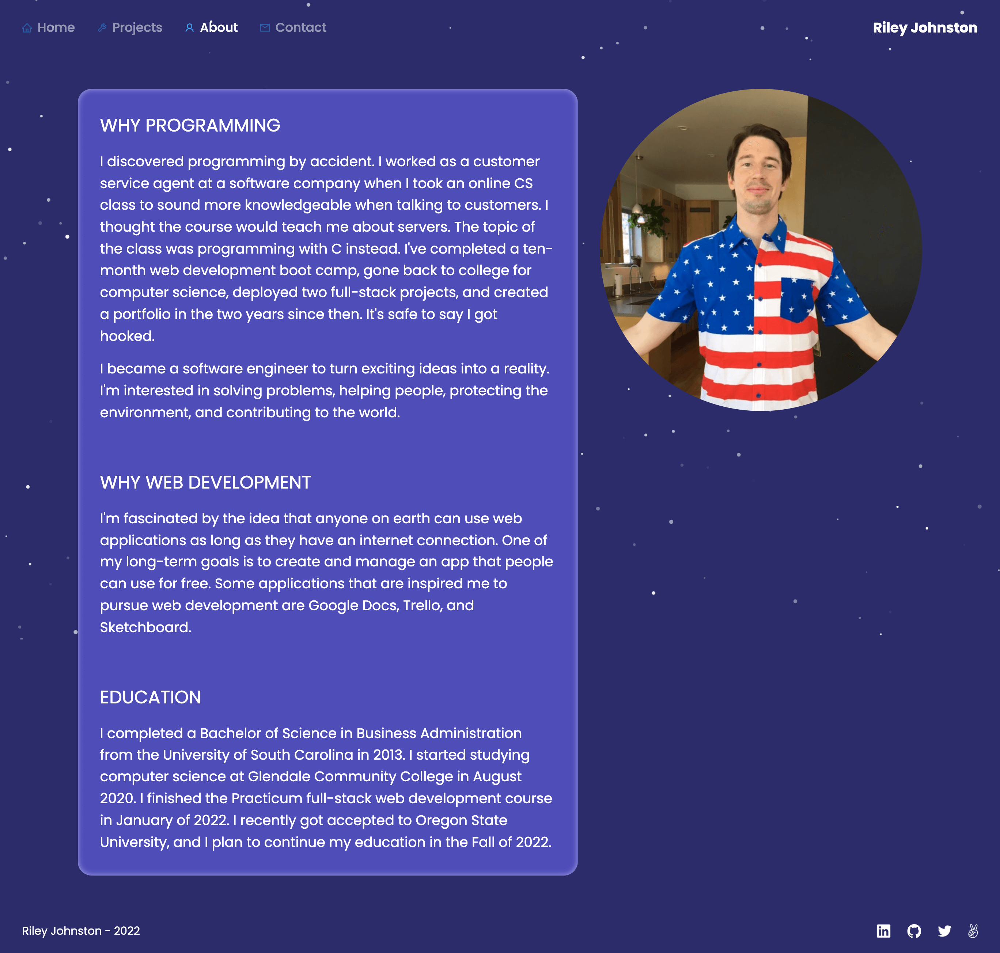
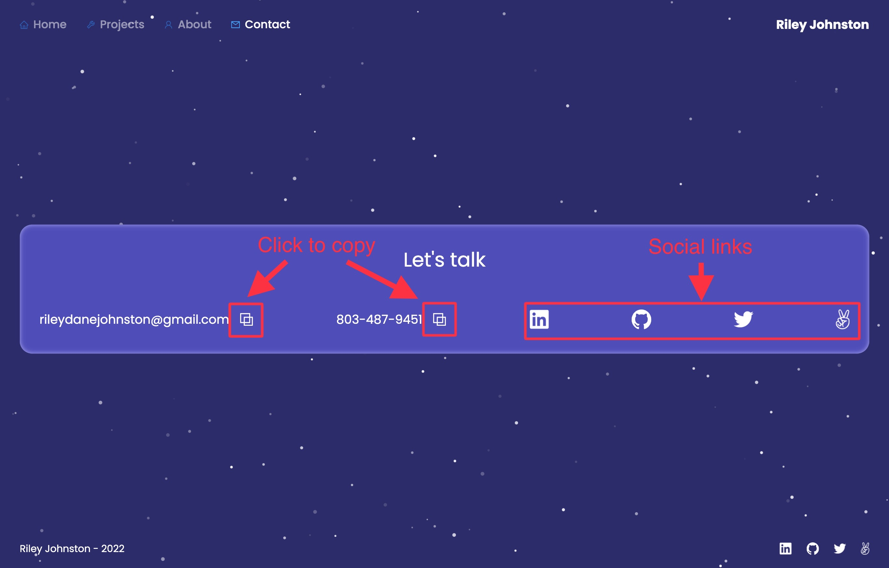

# Portfolio

My portfolio displays who I am and what I've built. [You can watch the demo here!](https://www.loom.com/share/4516c4096aea454c99c6410116f9f196)
  

[rileydanejohnston.com](https://rileydanejohnston.com) 
[www.rileydanejohnston.com](https://www.rileydanejohnston.com)
  

## Overview
* Homepage

  
* Technologies modal

  
* Projects page

  
* About page

  
* Contact page

  
## Technologies and Libraries
* React: user interface
* Styled-Components: styles
* Particle.js: interactive background